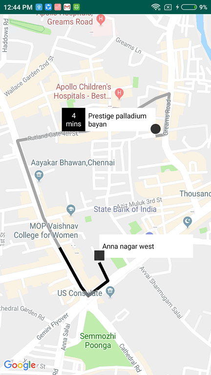

# Google-Map-Floating-Info-Window-Uber

An Android application to draw polyline on google maps with floating info window using route_key encoded string.

Youtube Link https://youtu.be/ld8XkVr78x8

# How to

### Step 1. Add the JitPack repository to your build file

    allprojects {
        repositories {
            ...
            maven { url 'https://jitpack.io' }
        }
    }
    
### Step 2. Add the dependency
    implementation 'com.github.gsanthosh91:Google-Map-Floating-Info-Window-Uber:version'
[jitpack.io](https://jitpack.io/#gsanthosh91/Google-Map-Floating-Info-Window-Uber/)

    
### Code

    @Override
    public void onMapReady(GoogleMap googleMap) {
        DecodeRoute decodeRoute = new DecodeRoute(this, googleMap, "{punAgqyhNIgAWAeE[iBKLh@VdA\\z@t@rALr@SrDdC@BHj@lDPvB?t@Ax@DRBf@Df@f@lFdHcBp@QnDy@jBi@bCiA|E_CrDaBhAu@BIWQ_BmCQF_C~@");
        decodeRoute.setSourceAddress(new DecodeAddress("Prestige palladium bayan", "4 mins"));
        decodeRoute.setDestinationAddress(new DecodeAddress("Anna nagar west", null));
        decodeRoute.start();
    }
